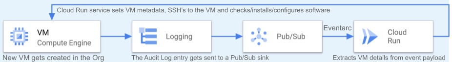

# New VM -> script install

```diff
- NOT PRODUCTION READY
- NO RESPONSIBLITY
- FOR DEMO PURPOSES ONLY
```

## about
Let’s consider an organization that wants to ensure all new VMs created in GCP have a particular software installed.
In this example I use nginx as the example software I want installed on all, as it allows to visually see the result in a browser.



* To accomplish that we are going to start from the Audit Logs entries which get written whenever a new VM is created. 
  * You can't disable Admin Activity audit logs, so we are 100% sure that we are notified for all new VMs.
  * We create an aggregated logging sink, at the organization level, which captures any new VM entry and sends it to a specified Pub/Sub topic
* That Log entry triggers a Cloud Run service which
gets the VM details (name, zone, project), 
SSHs into the VM and executes the needed script
* SSH is done via an IAP tunnel, so we are not exposing the VM to the world.
  * We only open communication with the IP range used by Google IAP
  * On top of that we need IAM access to perform IAP SSH login
* Note - in our example the script simply installs nginx. In real life examples the Cloud Run service would need to perform more actions - for example add more firewall rules.

This option allows us to run this script **without triggering a VM restart**.

Alternatively, we could set the startup script metadata and trigger a VM restart, upon which the script would be executed. See [this](https://github.com/kojnp/gcp-vm-creation-action).


## setup & test

```sh
bash setup.sh ORG_NAME="abcd.com" PROJECT_ID="xyz"

gcloud compute instances create test-vm-pubsub2 --machine-type=f1-micro --zone=us-central1-b --preemptible --no-restart-on-failure --maintenance-policy=terminate --tags http-server

```

In Console , go to Logging -> 
type in the query:
`resource.type=cloud_run_revision`
and click on "Run Query"

works also for VMs without a public IP
```
gcloud compute instances create test-vm-pubsub --machine-type=f1-micro --zone=us-central1-b --preemptible --no-restart-on-failure --maintenance-policy=terminate --no-address
```